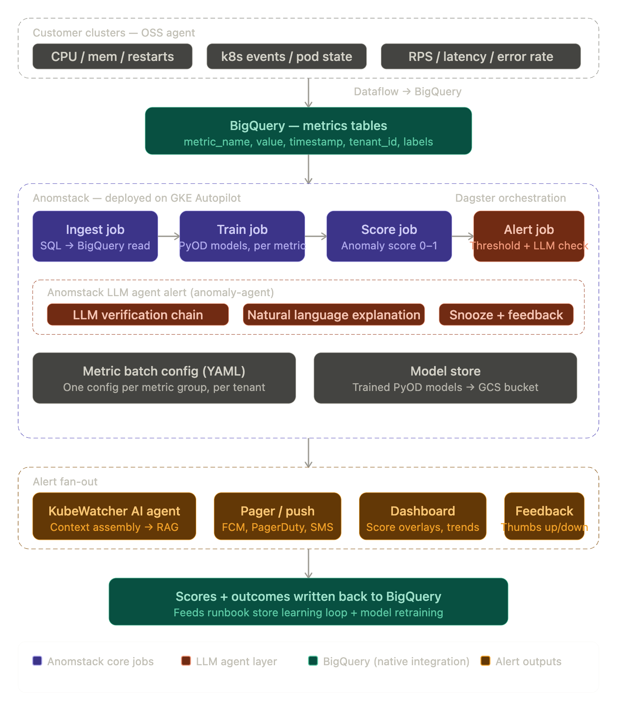
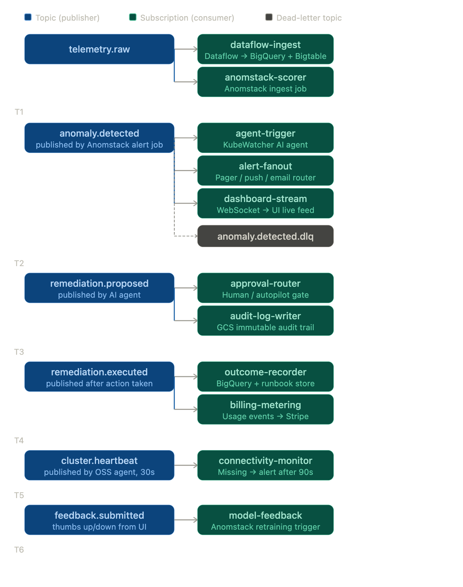
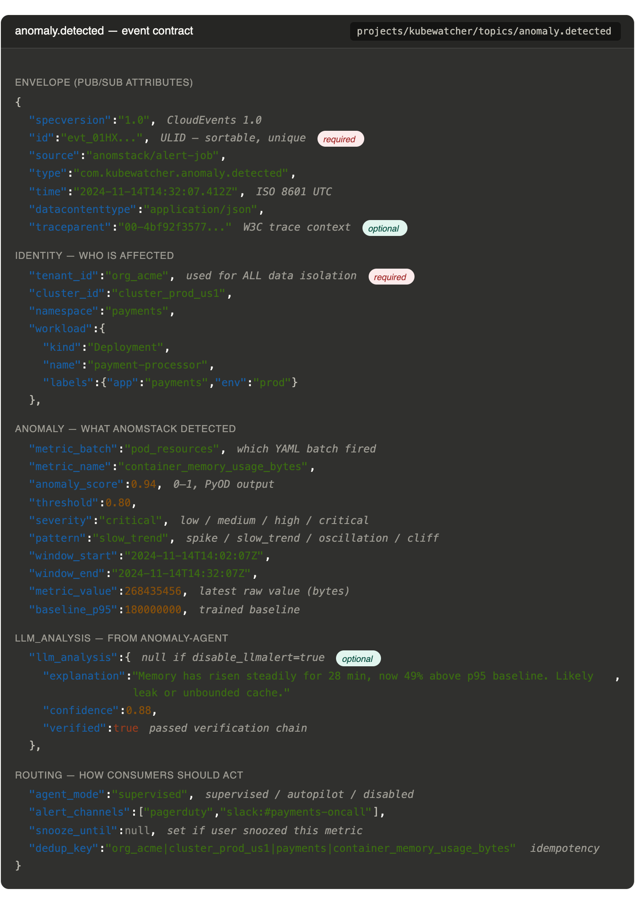

Two diagrams here — the first is the full topic map of all Pub/Sub topics and subscriptions in KubeWatcher, the second is the detailed event contract (the JSON schema) for the critical Anomstack → Agent message.Now the detailed event contract for the most critical message in the system — the `anomaly.detected` event that Anomstack publishes and the AI agent consumes:Here's the full design rationale:

---

**Topic topology — six topics, cleanly separated by concern.** `telemetry.raw` carries all raw metric events from the OSS agents — this fans out to two subscribers immediately: Dataflow (writes to BigQuery/Bigtable) and Anomstack's ingest job. Keeping raw telemetry on its own topic means you can add new consumers later (a future compliance archiver, a third-party integration) without touching anything else.

`anomaly.detected` is the central handoff point between Anomstack and the rest of the platform. It fans out to three subscribers in parallel — the AI agent trigger, the alert fan-out router (pager/push/email), and the dashboard WebSocket stream. This fan-out is what makes the architecture feel instant to users: the pager fires at the same time the dashboard lights up, not after the agent finishes thinking. The dead-letter queue (`anomaly.detected.dlq`) catches any message that fails all delivery attempts, so nothing is silently lost.

`remediation.proposed` and `remediation.executed` are separate topics deliberately. Proposed carries what the agent *wants* to do, consumed by the approval router which gates on the tenant's `agent_mode` setting. Executed carries what *actually happened*, consumed by the outcome recorder (which writes back to BigQuery and the runbook store) and the billing metering subscriber. Separating them means the audit trail is unambiguous — you always know the difference between intent and action.

`cluster.heartbeat` is a 30-second pulse from every connected OSS agent. The connectivity-monitor subscription maintains a last-seen timestamp per cluster in Bigtable and fires an alert after 90 seconds of silence — catching cases where a cluster has gone dark, a network partition has formed, or the agent pod has been evicted.

`feedback.submitted` closes the learning loop. When a user taps thumbs up or down on an alert or remediation in the app, that event goes to Pub/Sub and the model-feedback subscriber schedules a retraining run in Anomstack's Dagster pipeline for that specific metric batch.

**The event contract** is built on CloudEvents 1.0 for portability — this means if you later want to swap Pub/Sub for a different broker, the schema travels unchanged. The `dedup_key` field is critical: it's a deterministic composite of tenant, cluster, namespace, and metric name. Every consumer uses it for idempotency — if the alert job publishes the same anomaly twice due to a retry, the agent won't kick off two parallel investigations. The `agent_mode` field is tenant-configurable and scoped per metric batch, meaning one team can run autopilot on memory leak remediation while another keeps the same metric in supervised mode. The `llm_analysis` block from Anomstack's `anomaly-agent` is included inline — the AI agent consumes this explanation directly as part of its context bundle rather than re-deriving it.

**The one scaling concern to design around now:** `anomaly.detected` is your highest-fanout topic. At 100k concurrent clusters, a widespread cloud provider blip could produce tens of thousands of anomaly events in seconds, all fanning out to the alert router simultaneously. You need a rate-limit + dedup layer in Cloud Tasks *before* the alert router hits PagerDuty/FCM — group events by `dedup_key` within a 60-second window and send one consolidated alert, not a thousand individual ones.

Want me to design the approval workflow topic flow next, or the alert fan-out dedup/rate-limit layer?